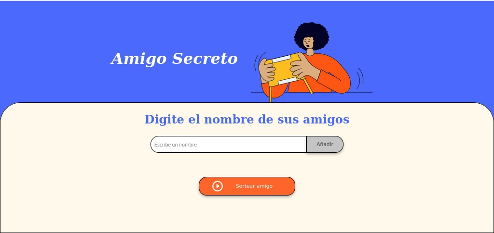
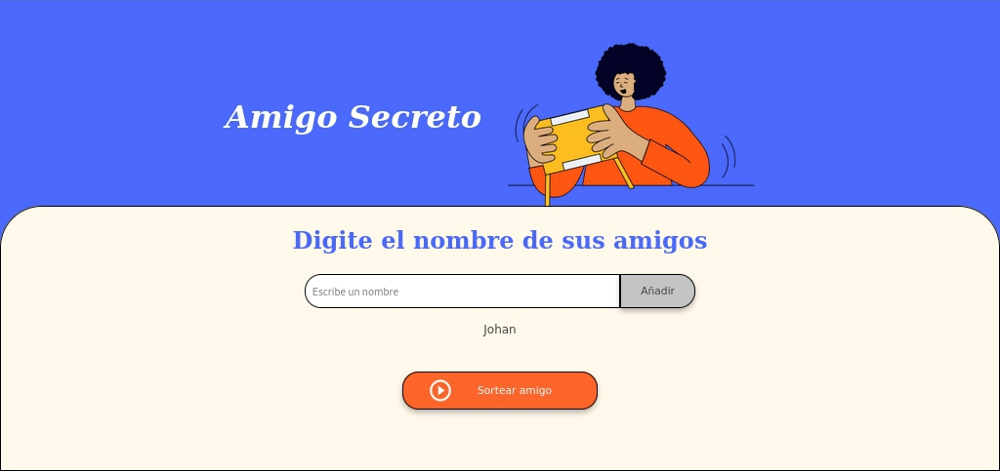
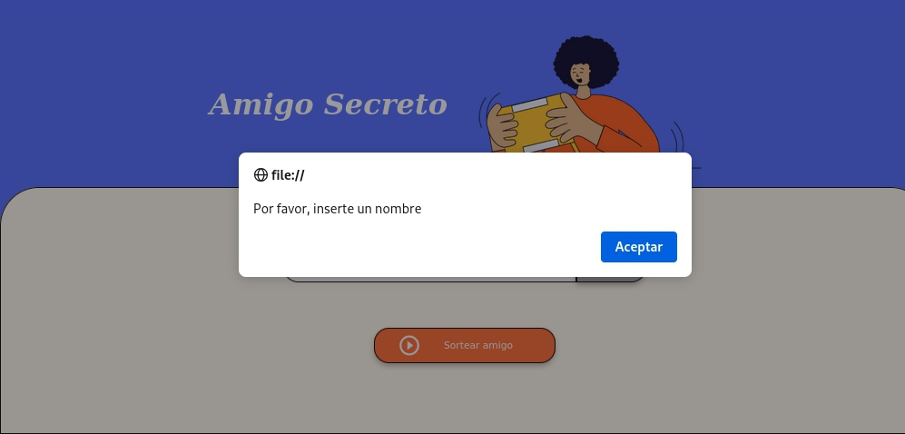
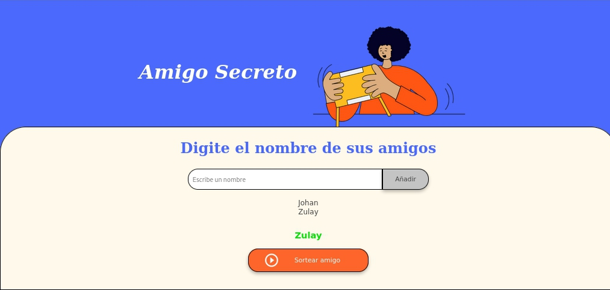
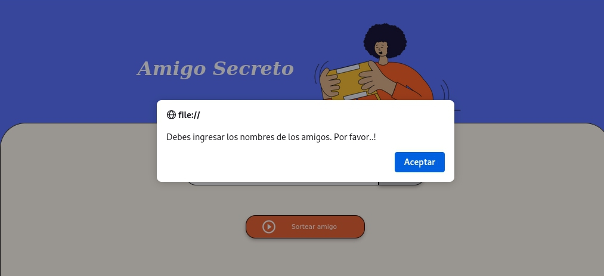

# amigo-secreto

 Juego amigo secreto

Descripción:

Este es un juego donde determinará quien es el amigo secreto, mediante un sorteo de los nombres ingresados previamente

<Para jugar debe seguir los siguientes pasos:>

Paso 1: Abrir en el navegador el archivo index.html

Paso 2: Ingresar cada uno de los nombres de los amigos a sortear, siguendo la sigues secuencia.

a) Escribir el nombre en dond dice "Escribe el nombre", tal como se muestra en la imagen 1.

Por ejemplo:

 Luego de escribir el nombre debe hacer click en el botón añadir, donde automáticamente se le mostrará el nombre del amigo añadido.

Nota: Debe ingresar un nombre, en caso de no ingresarlo se le mostrará el siguiente mensaje, que se muestra en la siguiente imagen

Paso 3: Una vez añadidos los nombres de los amigos, proceda a hacer click en el botón Sortear amigo, donde se le mostrará en pantalla el amigo secreto en color verde (💚) como puede observar en la siguiente imagen.

 Observación: En caso de no haber ingresado ningún nombre y le da click al botón Sortear amigo, automáticamente se le mostrará el un mensaje, como puede observar en la imagen

<h4> Suerte...! </h4> 
